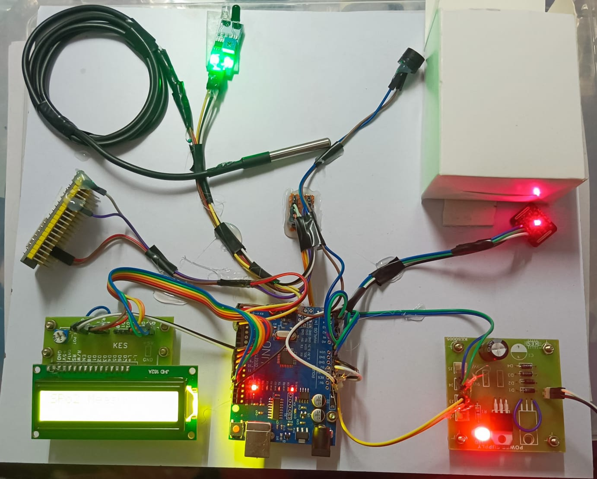

# IoT-based Healthcare Monitoring System

This repository contains the complete prototype implementation of our final year major project, “IoT-Based Healthcare Monitoring System.” It includes the core firmware for real-time health parameter monitoring, along with detailed documentation explaining the development approach, design decisions, and implementation workflow.

The repository also provides individual hardware testing codes for sensors and microcontroller modules, ensuring reliability and validation before system integration. In addition, a dedicated section highlights future improvements and upgrade possibilities, making the project scalable, extensible, and ready for real-world deployment. 



## Quick Start Guide
1. Install required libraries in Arduino IDE
2. Connect Arduino and select:
   - Correct processor type
   - Appropriate COM port
3. For ESP32:
   - Add ESP32 board support (install from [ESP32 GitHub](https://github.com/espressif/arduino-esp32))
4. For the perticular processor type read it's officla documenation and if any driver is needed then install that. 
 - 4.1. Visit [Arduino Official website](https://www.arduino.cc/) for Arduino official documentation. 
 - 4.2. Visit [ESP32 official website](https://www.espressif.com/en/products/socs/esp32) for ESP32 official documentation.  
4. Copy/refer the code from the repository and paste it in editor
5. Debug and upload
6. The processor will blink or respond while pushing the code. 


## Project Overview

A real-time IoT system to monitor vital health parameters:
- Pulse rate (MAX30100/MAX30102)
- SpO₂ (MAX30100/MAX30102)
- Body temperature (DS18B20)

### Key Features
- **Accuracy**:
  - ±2% for body temperature
  - ±5% for SpO₂
  - ±8% for pulse rate
- **Real-time monitoring** via ThingSpeak dashboard
- **Alert system** with buzzer for abnormal readings
- **Data transmission** via ESP32 WiFi

### Technical Specifications
- **Hardware**: Arduino Uno, ESP32, MAX30100, DS18B20, IR sensor
- **Software**: Embedded C++, Arduino IDE
- **Cloud Integration**: ThingSpeak API
- **Version Control**: Git/GitHub (≈ 647 Lines of codes)## ESP32 Telegram Alert System


## Individual Hardware Component Testing

Before integrating all modules into the complete IoT healthcare system, each hardware component was tested individually to ensure reliability, safety, and accurate sensor readings. This helped in early fault detection, component validation, and debugging during the development phase.

### Why Individual Testing Matters

- Identifies faulty sensors or loose connections early
- Ensures correct voltage, wiring, and polarity
- Validates sensor calibration and stable readings
- Reduces integration-stage failures
- Makes debugging faster and more structured

### Basic Testing Tools Used

- Digital Multimeter (DMM) — voltage, resistance & continuity checks
- Clamp Meter (optional) — current measurement for load testing
- Breadboard & jumper wires — rapid prototyping
- Power supply / USB power module
- Test cables & connectors

### Types of Tests Performed

- Continuity testing — wiring & connection validation
- Voltage level verification — power rail stability (3.3V / 5V)
- Sensor output validation — raw data monitoring over serial
- Load & current checks — device safety & overheating prevention
- Firmware upload testing — UART / COM port verification

Each hardware unit was verified independently before combining them into the final integrated system.

### Final Tested Codes

1. Visit [Link](https://github.com/AbiDev2003/IoT-healthcare-project/blob/main/DS18B20_temp_sensor.cpp) for DS18B20 tempretaure sensor testing code or click on ```DS18B20_temp_sensor.cpp``` to navigate. 

2. Visit [Link](https://github.com/AbiDev2003/IoT-healthcare-project/blob/main/MAX30102sensor.cpp) for MAX30102 pulse oxymeter testing code or click on ```MAX30102sensor.cpp``` to navigate. 

3. Visit [Link](https://github.com/AbiDev2003/IoT-healthcare-project/blob/main/ESP32_telegrambot_message.cpp) for telegram bot message testing code or click on ```ESP32_telegrambot_message.cpp``` to navigate. 

4. Visit [Link](https://github.com/AbiDev2003/IoT-healthcare-project/blob/main/ESP32mailalert.cpp) for mail message sending testing code or click on ```ESP32mailalert.cpp``` to navigate. 

5. Visit [Link](https://github.com/AbiDev2003/IoT-healthcare-project/blob/main/Prototype_code.cpp) for final implemented code in our project or click on ```Prototype_code.cpp``` to navigate. This code ensures the functionalities for DS18B20, MAX30102, and ThingSpeak API integration using ESP32 for real-time parameter data display. 

## ThingSpeak API Integration Guide

### Step 1: Channel Creation
1. Sign up/login at [ThingSpeak.com](https://thingspeak.com)
2. Click "New Channel"
3. Configure fields:
   - Field 1: `Temperature` (°C)
   - Field 2: `SpO₂` (%)
   - Field 3: `Pulse Rate` (BPM)
4. (Optional) Add description and metadata

### Step 2: API Keys
```plaintext
Channel ID:      Found in URL (e.g., 1234567)
Write API Key:   **************** (keep secret)
Read API Key:    **************** (for dashboards)
```
### Step 3: Complete ESP32 + ThingSpeak Integration Code

#### Full Implementation Example
```cpp
#include <WiFi.h>
#include <HTTPClient.h>

// WiFi Credentials
const char* ssid = "YOUR_WIFI_SSID";
const char* password = "YOUR_WIFI_PASSWORD";

// ThingSpeak Configuration
const char* server = "api.thingspeak.com";
const String apiKey = "YOUR_WRITE_API_KEY";
const long channelID = YOUR_CHANNEL_ID;

void setup() {
  Serial.begin(115200);
  WiFi.begin(ssid, password);
  
  while (WiFi.status() != WL_CONNECTED) {
    delay(500);
    Serial.print(".");
  }
  Serial.println("WiFi connected");
}

void loop() {
  if (WiFi.status() == WL_CONNECTED) {
    HTTPClient http;
    
    // Sample sensor values - replace with actual readings
    float temperature = 36.5;  // From DS18B20
    float spo2 = 98.0;         // From MAX30102
    int heartRate = 72;        // From MAX30102
    
    String url = "http://" + String(server) + "/update?api_key=" + apiKey +
                 "&field1=" + String(temperature) +
                 "&field2=" + String(spo2) +
                 "&field3=" + String(heartRate);
    
    http.begin(url);
    int httpCode = http.GET();
    
    if (httpCode > 0) {
      Serial.printf("[HTTP] GET... code: %d\n", httpCode);
    } else {
      Serial.printf("[HTTP] GET... failed, error: %s\n", http.errorToString(httpCode).c_str());
    }
    http.end();
  }
  delay(15000); // Wait 15 seconds between updates
}
```

#### Setup Instructions:
1. Create a Telegram bot using [BotFather](https://t.me/botfather)
2. Securely store your Telegram API key
3. Configure in code:
   - WiFi SSID (your hotspot name)
   - WiFi password
   - Telegram bot token
4. Upload code and test


## Future Improvements

### 1. ESP32 Mail Alert System
**IFTTT Method**:
1. Create IFTTT applet with Webhooks trigger
2. Configure ESP32 to send HTTP requests to IFTTT webhook
3. Set up email action in IFTTT
**SMTP Server Method**:
1. Configure email service credentials (Gmail, etc.)
2. Enable less secure apps or generate app password
3. Set SMTP server details in ESP32 code
4. Implement proper security measures

### 2. Mobile Number SMS Alert using GSM / LTE Module
To extend alert delivery beyond Wi-Fi and internet-dependent systems, the project can be upgraded to support SMS-based alerts using a GSM / LTE module. 

#### Recommendations: 
1. Prefer 4G / 5G LTE-compatible GSM modules. These provide better network stability, wider coverage, and future-proof communication.
2. Try to avoid older 2G-only GSM modules. Many regions are phasing out 2G networks, which may cause reliability issues in real-time alert delivery.

### 3. Cloud-Based Call & SMS Alerts (Twilio / Alternatives)
- The system can be extended to support software-based call and SMS alerts using cloud telephony APIs such as: **Twilio, Vonage (Nexmo), MSG91 / Fast2SMS (region-friendly options)**
- Instead of relying on GSM hardware, the ESP32 can trigger alerts through a backend or webhook, enabling: Voice call alerts, SMS notifications, WhatsApp alerts (where supported)

#### Benefits over GSM based approach

1. No SIM card or GSM module required
2. More reliable & scalable than hardware-based alerts
3. Suitable for remote monitoring and emergency notifications

This enhancement would make the alert system more flexible and deployment-ready for real-world healthcare applications.

### 4. Local OLED / TFT Display for On-Device Real-Time Vitals

A compact OLED / TFT screen can be added to display live sensor readings directly on the device, allowing quick monitoring without relying on cloud dashboards or internet connectivity.

#### Advantages:

1. Real-time vitals visible on-device (useful for bedside monitoring)
2. Helpful during testing, calibration, and field diagnostics

### 5. Offline Data Logging Using SD Card

To ensure data is not lost during internet or power outages, the system can support offline logging of sensor readings onto an SD card. Visit these documentation below to know how to implement. 
1. [ESP32: MicroSD Card Guide + Code (Arduino IDE)](https://randomnerdtutorials.com/esp32-microsd-card-arduino/)
2. [ESP32 Data Logging Temperature to MicroSD Card](https://randomnerdtutorials.com/esp32-data-logging-temperature-to-microsd-card/)
3. [ESP32 Log Data with Timestamp to SD Card (Overview + Code)](https://esp32io.com/tutorials/esp32-log-data-with-timestamp-to-sd-card?)

#### Key Benefits:

1. Enables continuous data recording during network failure
2. Supports later analysis for medical review and research

### 6. Battery Backup + Li-ion Charging Module (Portable Version)

The device can be upgraded to run on a rechargeable Li-ion battery with a charging and protection module, enabling safe and portable operation.

#### Battery Selection & Power Design (Portable Operation Guide)

For portable operation, a single-cell **3.7V Li-ion battery (18650 / Li-Po)** is generally the most suitable choice for this project. The ESP32 and sensor modules require a stable supply voltage, and Li-ion cells operate between 3.0V and 4.2V, which is not constant. Therefore, instead of connecting the battery directly, the battery should be routed through a charging and protection module first, and then regulated to a stable output voltage for safe device operation.

A **TP4056 charging + protection module** is recommended because it safeguards the battery against over-charge, over-discharge, and short-circuit conditions, making it suitable for continuous monitoring applications. The module is powered using a **5V / 1A standard mobile charger** (not fast chargers or 9V adapters). Once charged, the output of the TP4056 is taken to the load circuit.

Since the battery voltage varies during discharge, a **DC-DC boost converter** is used to step the voltage up to a consistent 5V, which is then supplied to the ESP32 via the VIN / 5V pin. This allows the onboard voltage regulator to generate a clean and stable 3.3V for the microcontroller and sensors.

#### Why the DC-DC boost converter is important ?(in brief):
- A Li-ion battery cannot provide a constant voltage — its output drops during discharge.
The boost converter ensures a stable 5V supply, preventing ESP32 resets, brown-outs, and sensor instability.

In this setup, the boost converter must be connected after the TP4056 output, not before it. The correct power chain is:
```
Li-ion Battery → TP4056 (Protection + Charging)
→ DC-DC Boost Converter (3.7V → 5V)
→ ESP32 VIN / 5V Pin
```

This arrangement ensures battery safety, stable power delivery, and uninterrupted monitoring during mobility or power failure scenarios.

### 7. Doctor / Caretaker Mobile App Integration

A companion mobile application can be developed to allow doctors or caretakers to remotely view health parameters and receive alerts instantly.

#### Potential Features:

1. Real-time vitals dashboard on mobile
2. Push notifications for abnormal readings

### 8. MQTT Broker Support for Hospital Networks

The system can be extended to publish sensor data using MQTT protocol, allowing seamless integration with hospital IoT infrastructures and monitoring servers. Visit these documentations below to know more. 

1. [Official MQTT Protocol docs](https://www.hivemq.com/mqtt/)
2. [ESP-MQTT API Docs (Espressif)](https://docs.espressif.com/projects/esp-idf/en/stable/esp32/api-reference/protocols/mqtt.html)
3. [ESP32 MQTT Publish/Subscribe Tutorial (Random Nerd Tutorials)](https://randomnerdtutorials.com/esp32-mqtt-publish-subscribe-arduino-ide/)
4. [Basic ESP32 MQTT Example](https://esp32io.com/tutorials/esp32-mqtt?)
5. [MQTT Broker Resources (Cloud + Testing)](https://www.hivemq.com/mqtt/public-mqtt-broker/)

#### Suggested MQTT Broker Options

- Mosquitto (Local Network Broker) — best for labs/testing
- HiveMQ Cloud — beginner-friendly cloud broker
- ThingSpeak MQTT API — compatible with IoT dashboards

#### Benefits:

1. Lightweight, low-latency data transmission
2. Supports centralized patient monitoring environments

### 9. Predictive Analytics Using Basic ML Models

Basic machine learning models can be introduced to analyze historical sensor data and detect early trends or anomalies in patient health conditions. In this project we can use models like **Logistic Regression, Random Forest Classifier, Support Vector Machine (SVM), ARIMA / Time-Series Forecasting, K-Means Clustering (Unsupervised)** etc..

#### Possible Use-Cases:

1. Early risk detection for abnormal patterns
2. Trend-based alerts instead of only threshold-based alerts

### 10. Geo-Location Tagging for Emergency Alerts

GPS-based location tagging can be added to emergency alerts so that doctors or caretakers can identify the patient’s location during critical situations. If the patient is outsde wi-fi range, it will be easy to locate the patient by using geoLocation (longitude + latitude). 

#### How It Works (Engineering Perspective)

- ##### GPS Module Integration 
A GPS (Global Positioning System) module like **NEO-6M / GPS-VK172** connects to ESP32 via UART (TX/RX). The module periodically receives satellite signals and outputs a standard NMEA sentence containing lat/long, time, speed, etc.

- ##### NMEA Parsing 
The ESP32 reads NMEA strings from the GPS, extracts fields like latitude, longitude, UTC timestamp, and optionally altitude.

- ##### Tagging in Alerts / Data Packets 
Whenever an emergency alert triggers (SMS / call trigger / cloud API), the extracted geolocation coordinates are appended to the message or data payload.

- ##### Optinal Antenna 
For better satellite reception it can be used. 

- ##### Fallback & Timestamps
If GPS signal is weak (indoors), you can choose to fall back on approximate location from cellular/GSM modules or last known GPS fix.

Read the documentation below to know how to implement this feature. 
1. [GPS NMEA Data Format & Basics (Arduino docs)](https://docs.arduino.cc/learn/communication/gps-nmea-data-101/)
2. [Guide to NEO-6M GPS Module with Arduino](https://randomnerdtutorials.com/guide-to-neo-6m-gps-module-with-arduino/)
3. [ESP32 with NEO-6M GPS Module (Arduino IDE)](https://randomnerdtutorials.com/esp32-neo-6m-gps-module-arduino/)
4. [TinyGPS++ Library Docs (Arduino)](https://github.com/mikalhart/TinyGPSPlus)

---

## Contibution

***Guided by :*** \
Prof. Subhendu Kumar Behera \
Associate Professor \
Department of Electonics and Telecommunication Engineering \
DRIEMS University, Tangi, Cuttack \
Portfolio: [Link](https://www.driems.ac.in/subhendu-kumar-behera/) 

***Project Team :*** \
Abinash Dash \
Sapta Ranjan Singh \
Debadatta Satapathy \
Sanket Kumar Chaudhury 

Batch of 2021-25\
Electronics and Telecommunication Engineering\
DRIEMS University, Tangi, Cuttack
 
---

## Acknowledgement

We would like to express our deepest gratitude to our project guide, **Prof. Subhendu Kumar Behera**, for his constant guidance, mentorship, and technical support throughout the development of this project. His insights, encouragement, and constructive feedback played a key role in shaping the design, testing, and successful completion of this work.

We would also like to thank the Department of Electronics & Telecommunication Engineering and DRIEMS University, Tangi, Cuttack, for providing laboratory facilities, resources, and a supportive academic environment that enabled us to carry out experimentation and project implementation smoothly.

---
## Author
**Abinash Dash**  
GitHub: [AbiDev2003](https://github.com/AbiDev2003)
